FNA is not a game engine in the traditional sense - it's a library of code for you to build your own engine. 

This means that we need to set up FNA as a library available somewhere on our computer before we can even think about starting our new game project.

In this guide, you'll see statements like "use FNA to make your game" or "use FNA to make your game engine" -- we're using "game" and "game engine" interchangeably here. Either way, you must make a lot of things yourself to make a game using FNA - some developers like to make an engine and then make a game, some developers like to make a game and then turn that into an engine for more games later. It's up to you. FNA provides flexibility!

## FNA Installation & Setup

The installation steps in this section are not related to making your super awesome unique epic game idea. This is about preparing our development environment.

1. Install and set up GitHub Desktop. 
	- Most Unity devs I know IRL are scared of version control - this is the least-painful way of getting into version control. 
	- Download it from here: https://desktop.github.com/
2. Visit the FNA repository on the GitHub website: https://github.com/FNA-XNA/FNA 
3. Click on the green "Code" button, which is a dropdown menu.
4. Click on the menu option that says "Open with GitHub Desktop". 

   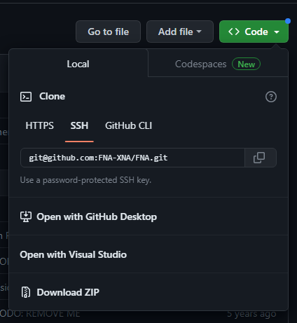
5. GitHub Desktop will prompt you, asking you where to save FNA. Save it wherever you want, just remember where it is. 
	- GitHub Desktop _should_ automatically handle any recursive git steps, which you may see mentioned in other FNA setup guides - recursive git steps are related to FNA grabbing its dependencies.
6. In GitHub, make a new repository for your game.

   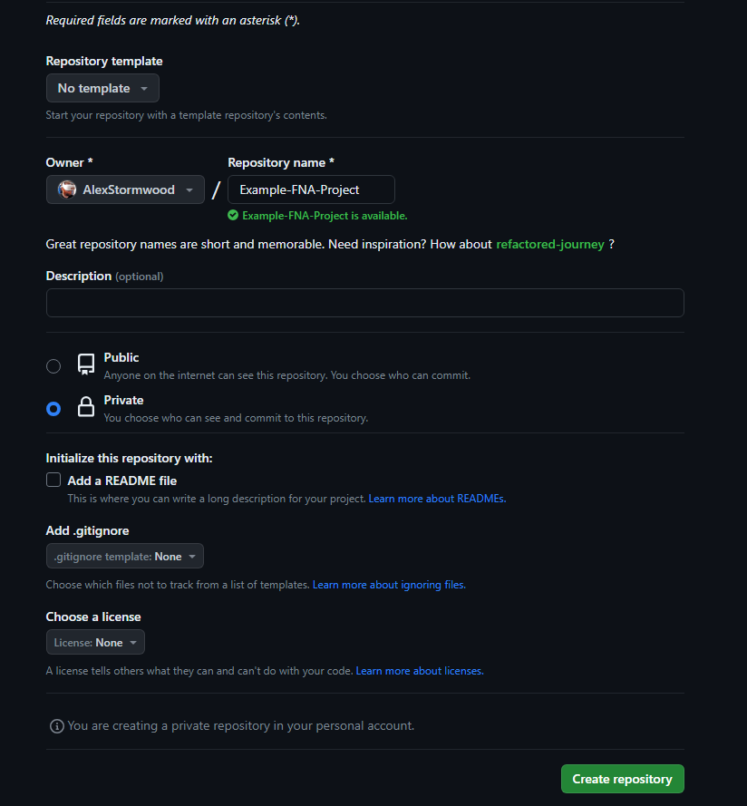

7. Clone your new game repository to your computer. Again, you can do this via GitHub Desktop - and there is a nice button prompt to help with that on the GitHub webpage for your repo:

   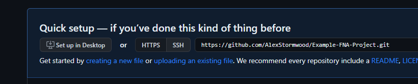

   Make sure you remember where your new repository is saved on your computer! 

   - It may also be wise to set up a `.gitignore` file in your new game directory - it helps keep the GitHub repository from being too bloated by ignoring specific, unneeded files from the repository's tracking. Make a `.gitignore` file using whatever tool you like, stick it in the repo, and edit it with your favourite text editor to contain the text here as its contents: [https://raw.githubusercontent.com/github/gitignore/main/VisualStudio.gitignore](https://raw.githubusercontent.com/github/gitignore/main/VisualStudio.gitignore)
8. Using Visual Studio 2022, make a new project. For the sake of using super awesome modern C#, you should make a `Console App` that targets the `.NET 7.0` framework.
	- You may need to modify your Visual Studio installation if the `Console App` project template is not available. Follow this page, and grab any module that sounds C#-related: https://learn.microsoft.com/en-us/visualstudio/install/modify-visual-studio?view=vs-2022&preserve-view=true#modify-individual-components 
	- Because we set up our GitHub repository first and cloned it to the computer, we can save our new Visual Studio project directly into the repository folder. If all is correctly configured, Visual Studio should just say "This directory is not empty" - even if it is, because git stores hidden files in the directory even if you have nothing in the repository.
	  
      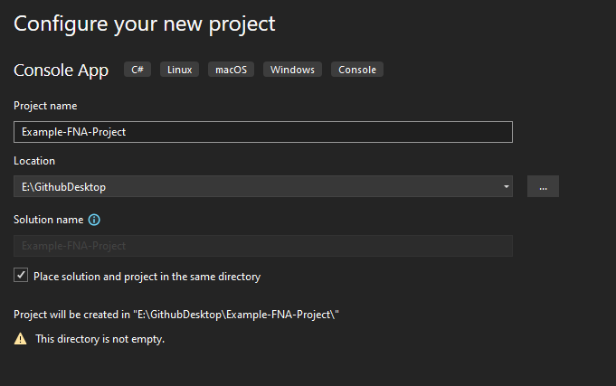

9. In your new Visual Studio project, find the `Solution` window. You want to right-click on the `Solution 'Project Name Here' (1 of 1 project)` line within that window.

   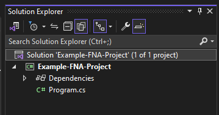

10. Find the menu item for `Add`, hover your mouse over it, and then find & click on the `Existing Project...` option.

    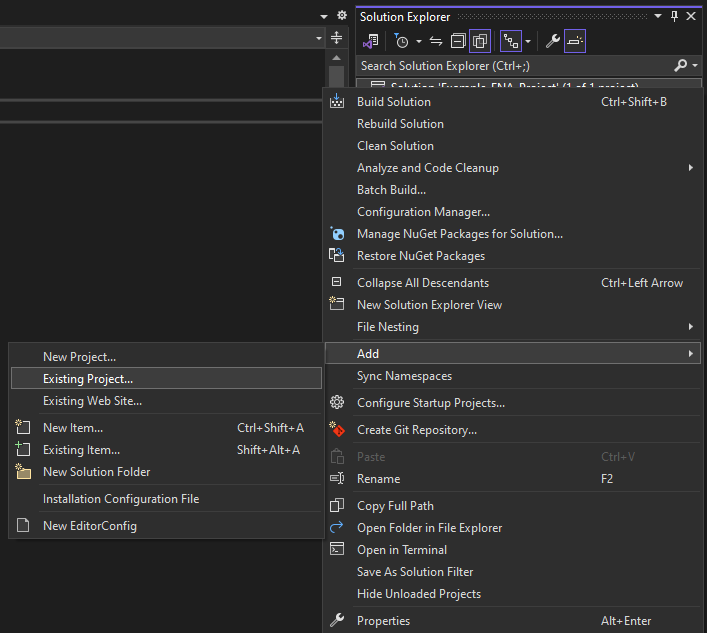

11. Now we can connect FNA to our game or game engine. In step 5, we cloned FNA to our computer. We want to find the directory that stores the FNA repository on our computer, and select one of the `.csproj` files available within the repository. Because our game project is using .NET 7.0, we should use the `FNA.Core.csproj` file - keep things consistently modern.

    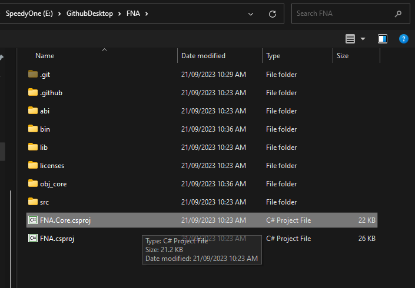

12. The Solution window of Visual Studio should now show two (2) projects: our game, and FNA or FNA.Core. This is good! We still need to make our game project specifically reference the FNA project before we can use it, so let's do that. Right-click on your game project (eg. our game project is `Example-FNA-Project`) in the Solution window, find the `Add` menu again, and choose `Project Reference...` - the menu is different to what we saw in the `Solution -> Add` menu!

    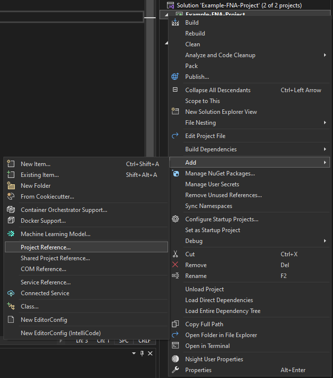

13. From the window that appears in the previous step, we can choose our flavour of FNA. Tick the box next to its name, and then hit `OK` to close the window.

    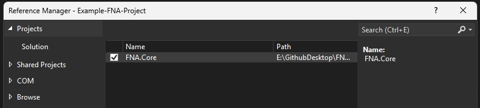

14. From here, we are _almost_ ready to code. Find and/or create folders in your project in your computer's File Explorer (not Visual Studio!) so that you can access the `net7.0` folder in this path: `\bin\Debug\net7.0`
    For example, our project is named `Example-FNA-Project`, so the path we need ends up like this: 

    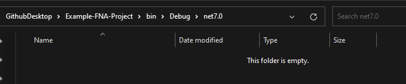

This is our development output directory, it's only relevant to us - the developer doing the development!

15. Now, we need to grab FNA dependency _native libraries_. These are OS-specific variants of dependencies that were not grabbed during the FNA repository cloning, but we need them nonetheless. Grab the pre-bundled download that contains all variants for all OS's here: [native libraries](https://fna.flibitijibibo.com/archive/fnalibs.tar.bz2) 
    Download it, extract it using a tool such as 7-Zip. We want to be able to see folders for each platform or OS, like this: 

    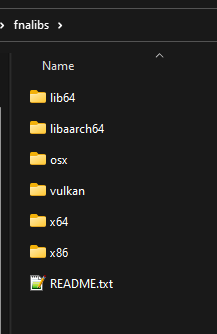

16. So, each folder is relevant in different types of computers, and this should only impact _development_, not distribution. For this guide, I'm running Windows 11 64-bit, so I need to open the `x64` folder. If you're on MacOS, you want the `osx` folder. Open up your relevant folder so you can see these contents: 

    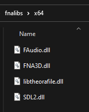

17. Copy the files across to your `bin/Debug/net7.0` folder. It should look like this now:

    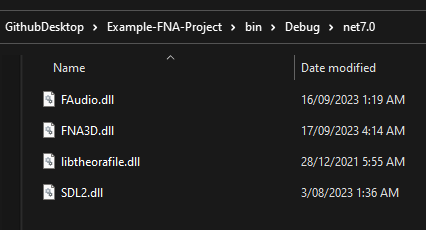

18. Now, we are ready to code! Find your project's `Program.cs` file and copy this code into it:

```csharp
using System;
using Microsoft.Xna.Framework;

static class Program
{
    [STAThread]
    static void Main(string[] args)
    {
        using (Game g = new Game())
        {
            new GraphicsDeviceManager(g);
            g.Run();
        }
    }
}
```

This code is copied as-is from the "The First Program" segment of the "FNA From Scratch Tutorial", available here: [https://github.com/FNA-XNA/FNA/wiki/2b:-FNA-From-Scratch-Tutorial#the-first-program](https://github.com/FNA-XNA/FNA/wiki/2b:-FNA-From-Scratch-Tutorial#the-first-program) 

If your FNA project reference is configured correctly, there should be no errors (eg. red or yellow squiggles underlining any part of the code).

19. Click on the solid green play button towards the top-middle of the Visual Studio window. It should have your project name in it, like this: 

    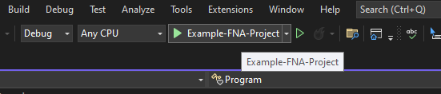

20. Two windows should open up:
	- The debugger.
	- The game.
	  The game currently does nothing, renders nothing - it should be a plain black screen. Confirm that the two windows work, and then close them both (or find and click on the solid red square / stop button in Visual Studio).

	  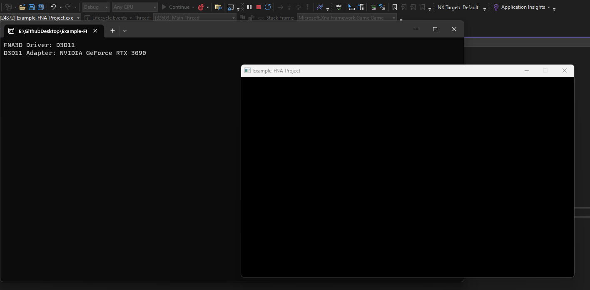

I'm still learning FNA as I write this, so for now: that's it! 

You have your first FNA project running! You can continue learning and creating by following the tutorial on the FNA wiki now - we've done a slightly different path to installing and setting up FNA, but we've also just done the "The First Program" segment of the "FNA From Scratch Tutorial" here without any changes.

So, in theory, you can keep going without any changes too! Move on to the "The First Game Object" segment of the "FNA From Scratch Tutorial" on the wiki: https://github.com/FNA-XNA/FNA/wiki/2b:-FNA-From-Scratch-Tutorial#the-first-game-object 

# More to come, eventually!